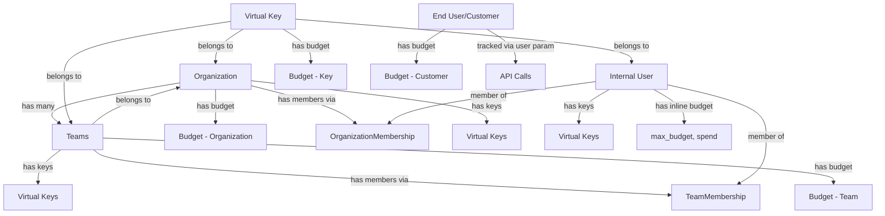

# LiteLLM Entity Hierarchy and Relationships

Complete documentation of the entity hierarchy, data model, and API endpoints for Organizations, Teams, Users, Virtual Keys, and Customers (End Users) in LiteLLM Proxy.

---

## Table of Contents

1. [Entity Hierarchy Overview](#entity-hierarchy-overview)
2. [Entity Relationships Diagram](#entity-relationships-diagram)
3. [Entity Details](#entity-details)
4. [API Endpoints](#api-endpoints)
5. [Example Workflows](#example-workflows)
6. [Spend Tracking](#spend-tracking)
7. [Budget Management](#budget-management)

---

## Entity Hierarchy Overview

```
Organization (LiteLLM_OrganizationTable)
    ├── Budget (LiteLLM_BudgetTable) [org-level budget]
    ├── Teams (LiteLLM_TeamTable) [multiple teams belong to one org]
    │   ├── Budget (LiteLLM_BudgetTable) [team-level budget]
    │   ├── Members (Users) via teams array in UserTable
    │   │   └── TeamMembership (LiteLLM_TeamMembership) [user budget within team]
    │   └── Virtual Keys (LiteLLM_VerificationToken)
    ├── Members (Users) via OrganizationMembership
    │   └── OrganizationMembership (LiteLLM_OrganizationMembership) [user role + budget in org]
    └── Virtual Keys (LiteLLM_VerificationToken) [org-scoped keys]

Users (LiteLLM_UserTable) [Internal Users - admins, team members]
    ├── Budget (inline fields: max_budget, spend, etc.)
    ├── Teams (teams array field) [list of team_ids]
    ├── Organizations (via OrganizationMembership)
    └── Virtual Keys (LiteLLM_VerificationToken) [user-scoped keys]

Virtual Keys (LiteLLM_VerificationToken)
    ├── Budget (LiteLLM_BudgetTable OR inline fields)
    ├── User (user_id) [optional]
    ├── Team (team_id) [optional]
    └── Organization (organization_id) [optional]

Customers/End Users (LiteLLM_EndUserTable) [External users of your service]
    ├── Budget (LiteLLM_BudgetTable)
    └── Tracked via 'user' param in API calls
```

---

## Entity Relationships Diagram

### Core Relationships



### Foreign Key Relationships (schema.prisma)

**Organizations:**
- `budget_id` → `LiteLLM_BudgetTable.budget_id`
- `object_permission_id` → `LiteLLM_ObjectPermissionTable.object_permission_id`

**Teams:**
- `organization_id` → `LiteLLM_OrganizationTable.organization_id`
- `model_id` → `LiteLLM_ModelTable.id` (for team-level model aliases)
- `object_permission_id` → `LiteLLM_ObjectPermissionTable.object_permission_id`

**Users:**
- `organization_id` → `LiteLLM_OrganizationTable.organization_id` (deprecated, use OrganizationMembership)
- `teams` → Array of `team_id` (list of teams user belongs to)
- `object_permission_id` → `LiteLLM_ObjectPermissionTable.object_permission_id`

**Virtual Keys:**
- `user_id` → `LiteLLM_UserTable.user_id`
- `team_id` → `LiteLLM_TeamTable.team_id`
- `organization_id` → `LiteLLM_OrganizationTable.organization_id`
- `budget_id` → `LiteLLM_BudgetTable.budget_id`
- `object_permission_id` → `LiteLLM_ObjectPermissionTable.object_permission_id`

**Customers (End Users):**
- `budget_id` → `LiteLLM_BudgetTable.budget_id`

**OrganizationMembership:**
- `user_id` → `LiteLLM_UserTable.user_id`
- `organization_id` → `LiteLLM_OrganizationTable.organization_id`
- `budget_id` → `LiteLLM_BudgetTable.budget_id` (user budget within org)

**TeamMembership:**
- `user_id` → `LiteLLM_UserTable.user_id`
- `team_id` → `LiteLLM_TeamTable.team_id`
- `budget_id` → `LiteLLM_BudgetTable.budget_id` (user budget within team)

---

## Entity Details

### 1. Organization (LiteLLM_OrganizationTable)

**Purpose:** Top-level entity for multi-tenancy. Organizations can own multiple teams, users, and keys. Useful for SaaS platforms serving multiple customers/companies.

**Key Fields:**
- `organization_id` (String, PK): Unique identifier
- `organization_alias` (String): Human-readable name
- `budget_id` (String, FK): Reference to organization's budget
- `models` (String[]): Models this org has access to
- `spend` (Float): Total spend by org
- `model_spend` (Json): Spend breakdown per model
- `metadata` (Json): Custom metadata
- `created_by`, `updated_by` (String): Audit fields

**Relationships:**
- Has many `teams` (1:N)
- Has many `users` (1:N) - deprecated, use OrganizationMembership
- Has many `keys` (1:N)
- Has many `members` via `OrganizationMembership` (1:N)
- Has one `litellm_budget_table` (1:1)
- Has one `object_permission` (1:1)

**Use Cases:**
- Multi-tenant SaaS platforms
- Isolating teams/resources by customer/company
- Organization-level spend tracking and limits
- Organization-level model access control

---

### 2. Team (LiteLLM_TeamTable)

**Purpose:** Groups users and keys together with shared budget, rate limits, and model access. Teams belong to organizations (optional) or exist independently.

**Key Fields:**
- `team_id` (String, PK): Unique identifier
- `team_alias` (String): Human-readable name
- `organization_id` (String, FK, optional): Parent organization
- `admins` (String[]): List of admin user_ids
- `members` (String[]): List of member user_ids
- `members_with_roles` (Json): Members with their roles
- `models` (String[]): Accessible models
- `max_budget` (Float): Team budget limit
- `spend` (Float): Total spend by team
- `tpm_limit`, `rpm_limit` (BigInt): Rate limits
- `budget_duration` (String): Budget reset frequency (e.g., "30d", "1mo")
- `budget_reset_at` (DateTime): When budget resets
- `model_spend` (Json): Per-model spend
- `model_max_budget` (Json): Per-model budget limits
- `router_settings` (Json): Team-specific routing config
- `team_member_permissions` (String[]): Permissions for team members
- `blocked` (Boolean): Block all team requests

**Relationships:**
- Belongs to one `organization` (N:1, optional)
- Has many members via `members` and `members_with_roles`
- Has many memberships via `TeamMembership` (1:N) - for user budgets within team
- Has one `litellm_model_table` (1:1) - for team-level model aliases
- Has one `object_permission` (1:1)

**Use Cases:**
- Department-level access control
- Project-based budgets
- Team-specific model routing
- Collaborative API key management

---

### 3. User (LiteLLM_UserTable)

**Purpose:** Internal users (employees, admins, team members) who manage the proxy or belong to teams. NOT external customers.

**Key Fields:**
- `user_id` (String, PK): Unique identifier
- `user_alias` (String): Display name
- `user_email` (String): Email address
- `user_role` (String): Role - `proxy_admin`, `proxy_admin_viewer`, `internal_user`, `internal_user_viewer`, `team`, `customer`
- `teams` (String[]): List of team_ids user belongs to
- `organization_id` (String, FK): Organization (deprecated, use OrganizationMembership)
- `max_budget` (Float): User budget limit
- `spend` (Float): Total spend
- `models` (String[]): Accessible models
- `tpm_limit`, `rpm_limit` (BigInt): Rate limits
- `budget_duration` (String): Budget reset frequency
- `budget_reset_at` (DateTime): When budget resets
- `model_spend` (Json): Per-model spend
- `metadata` (Json): Custom metadata
- `allowed_cache_controls` (String[]): Cache control settings
- `password` (String): For SSO/login

**Relationships:**
- Belongs to organizations via `OrganizationMembership` (N:N)
- Belongs to teams via `teams` array and `TeamMembership` (N:N)
- Has many `keys` via user_id (1:N)
- Has one `object_permission` (1:1)

**User Roles:**
- `proxy_admin`: Full admin access
- `proxy_admin_viewer`: Read-only admin
- `internal_user`: Regular team member
- `internal_user_viewer`: Read-only team member
- `team`: Team-scoped access
- `customer`: External customer (use End User instead)

**Use Cases:**
- Admin user accounts
- Team member accounts
- Per-user spend tracking
- User-specific model access

---

### 4. Virtual Key (LiteLLM_VerificationToken)

**Purpose:** API keys used to authenticate requests to the proxy. Can be scoped to user, team, or organization.

**Key Fields:**
- `token` (String, PK): Hashed API key
- `key_name` (String): Descriptive name
- `key_alias` (String): Display alias
- `user_id` (String, FK, optional): Owner user
- `team_id` (String, FK, optional): Associated team
- `organization_id` (String, FK, optional): Associated org
- `budget_id` (String, FK, optional): Key-specific budget
- `models` (String[]): Accessible models
- `aliases` (Json): Model aliases for this key
- `config` (Json): Key-specific config
- `max_budget` (Float): Key budget limit
- `spend` (Float): Total spend
- `tpm_limit`, `rpm_limit` (BigInt): Rate limits
- `budget_duration`, `budget_reset_at`: Budget settings
- `expires` (DateTime): Key expiration
- `permissions` (Json): Key permissions
- `metadata` (Json): Custom metadata
- `blocked` (Boolean): Block this key
- `allowed_cache_controls` (String[]): Cache settings
- `allowed_routes` (String[]): Allowed endpoints

**Rotation Fields:**
- `rotation_count` (Int): Times rotated
- `auto_rotate` (Boolean): Auto-rotation enabled
- `rotation_interval` (String): Rotation frequency
- `last_rotation_at`, `key_rotation_at` (DateTime): Rotation timestamps

**Relationships:**
- Belongs to one `user` (N:1, optional)
- Belongs to one `team` (N:1, optional)
- Belongs to one `organization` (N:1, optional)
- Has one `litellm_budget_table` (1:1, optional)
- Has one `object_permission` (1:1)

**Use Cases:**
- Service account keys
- User-specific keys
- Team-shared keys
- Temporary access keys

---

### 5. Customer/End User (LiteLLM_EndUserTable)

**Purpose:** External customers/end-users of your service. Tracked via `user` parameter in API calls. Different from internal Users.

**Key Fields:**
- `user_id` (String, PK): Unique identifier
- `alias` (String): Admin-facing name
- `spend` (Float): Total spend
- `allowed_model_region` (String): Required model region (e.g., "eu", "us")
- `default_model` (String): Fallback model
- `budget_id` (String, FK): Customer budget
- `blocked` (Boolean): Block this customer

**Relationships:**
- Has one `litellm_budget_table` (1:1)

**Use Cases:**
- External customer tracking
- Per-customer billing
- Regional compliance (GDPR)
- Customer spend limits

**Tracking:**
Customers are tracked via the `user` parameter in API calls:
```python
response = completion(
    model="gpt-4",
    messages=[{"role": "user", "content": "Hello"}],
    user="customer-123"  # End user ID
)
```

---

### 6. Budget (LiteLLM_BudgetTable)

**Purpose:** Shared budget configuration that can be attached to organizations, teams, keys, end users, or users within teams/orgs.

**Key Fields:**
- `budget_id` (String, PK): Unique identifier
- `max_budget` (Float): Maximum spend limit
- `soft_budget` (Float): Alert threshold (doesn't block)
- `max_parallel_requests` (Int): Concurrent request limit
- `tpm_limit` (BigInt): Tokens per minute
- `rpm_limit` (BigInt): Requests per minute
- `model_max_budget` (Json): Per-model budgets
- `budget_duration` (String): Reset frequency
- `budget_reset_at` (DateTime): Reset timestamp
- `created_by`, `updated_by` (String): Audit fields

**Relationships (one budget can be shared by many):**
- Used by `organization` (1:N)
- Used by `keys` (1:N)
- Used by `end_users` (1:N)
- Used by `tags` (1:N)
- Used by `team_membership` (1:N)
- Used by `organization_membership` (1:N)

**Use Cases:**
- Shared budget across multiple teams
- Reusable budget templates (e.g., "free_tier", "paid_tier")
- Centralized budget management

---

### 7. OrganizationMembership (LiteLLM_OrganizationMembership)

**Purpose:** Link users to organizations with role and budget tracking within that organization.

**Key Fields:**
- `user_id` (String, PK composite): User identifier
- `organization_id` (String, PK composite): Organization identifier
- `user_role` (String): Role within organization (e.g., "org_admin", "internal_user")
- `spend` (Float): User's spend within this organization
- `budget_id` (String, FK): User's budget within this organization

**Relationships:**
- Belongs to one `user` (N:1)
- Belongs to one `organization` (N:1)
- Has one `litellm_budget_table` (1:1, optional)

**Use Cases:**
- User has different roles in different organizations
- Track user spend per organization
- Set per-user budgets within organizations

---

### 8. TeamMembership (LiteLLM_TeamMembership)

**Purpose:** Link users to teams with spend and budget tracking within that team.

**Key Fields:**
- `user_id` (String, PK composite): User identifier
- `team_id` (String, PK composite): Team identifier
- `spend` (Float): User's spend within this team
- `budget_id` (String, FK): User's budget within this team

**Relationships:**
- Belongs to one `user` (implied, not explicit FK)
- Belongs to one `team` (implied, not explicit FK)
- Has one `litellm_budget_table` (1:1, optional)

**Use Cases:**
- Track user spend per team
- Set per-user budgets within teams
- User-level limits within team context

---

## API Endpoints

### Organization Endpoints

**Base URL:** `/organization`

| Method | Endpoint | Description | Auth Required |
|--------|----------|-------------|---------------|
| POST | `/organization/new` | Create new organization | Proxy Admin |
| PATCH | `/organization/update` | Update organization | Proxy Admin |
| DELETE | `/organization/delete` | Delete organization(s) | Proxy Admin |
| GET | `/organization/list` | List organizations | Any User |
| GET | `/organization/info?organization_id=<id>` | Get organization details | Any User |
| POST | `/organization/member_add` | Add member to organization | Proxy Admin / Org Admin |
| PATCH | `/organization/member_update` | Update member role/budget | Proxy Admin / Org Admin |
| DELETE | `/organization/member_delete` | Remove member from organization | Proxy Admin / Org Admin |
| GET | `/organization/daily/activity` | Get daily spend analytics | Any User |

**Create Organization:**
```bash
curl -X POST 'http://0.0.0.0:4000/organization/new' \
  -H 'Authorization: Bearer sk-1234' \
  -H 'Content-Type: application/json' \
  -d '{
    "organization_alias": "Acme Corp",
    "models": ["gpt-4", "gpt-3.5-turbo"],
    "max_budget": 1000.0,
    "budget_duration": "1mo"
  }'
```

**Add Member to Organization:**
```bash
curl -X POST 'http://0.0.0.0:4000/organization/member_add' \
  -H 'Authorization: Bearer sk-1234' \
  -H 'Content-Type: application/json' \
  -d '{
    "organization_id": "org-123",
    "member": {
      "user_id": "user-456",
      "role": "internal_user"
    },
    "max_budget_in_organization": 100.0
  }'
```

---

### Team Endpoints

**Base URL:** `/team`

| Method | Endpoint | Description | Auth Required |
|--------|----------|-------------|---------------|
| POST | `/team/new` | Create new team | Any User |
| POST | `/team/update` | Update team | Team Admin / Proxy Admin |
| POST | `/team/delete` | Delete team(s) | Proxy Admin |
| POST | `/team/block` | Block/unblock team | Proxy Admin |
| GET | `/team/list` | List teams | Any User |
| GET | `/team/info?team_id=<id>` | Get team details | Any User |
| POST | `/team/member_add` | Add member to team | Team Admin / Proxy Admin |
| POST | `/team/member_update` | Update member in team | Team Admin / Proxy Admin |
| POST | `/team/member_delete` | Remove member from team | Team Admin / Proxy Admin |
| GET | `/team/daily/activity` | Get daily spend analytics | Any User |

**Create Team:**
```bash
curl -X POST 'http://0.0.0.0:4000/team/new' \
  -H 'Authorization: Bearer sk-1234' \
  -H 'Content-Type: application/json' \
  -d '{
    "team_alias": "Engineering",
    "organization_id": "org-123",
    "models": ["gpt-4"],
    "max_budget": 500.0,
    "budget_duration": "30d"
  }'
```

**Add Member to Team:**
```bash
curl -X POST 'http://0.0.0.0:4000/team/member_add' \
  -H 'Authorization: Bearer sk-1234' \
  -H 'Content-Type: application/json' \
  -d '{
    "team_id": "team-789",
    "member": {
      "user_id": "user-456",
      "role": "user"
    },
    "max_budget_in_team": 50.0
  }'
```

---

### User Endpoints (Internal Users)

**Base URL:** `/user`

| Method | Endpoint | Description | Auth Required |
|--------|----------|-------------|---------------|
| POST | `/user/new` | Create new internal user | Proxy Admin |
| POST | `/user/update` | Update user | User / Proxy Admin |
| POST | `/user/bulk_update` | Bulk update users | Proxy Admin |
| POST | `/user/delete` | Delete user(s) | Proxy Admin |
| GET | `/user/list` | List users (paginated) | Any User |
| GET | `/user/info?user_id=<id>` | Get user details | User / Proxy Admin |
| GET | `/user/daily/activity` | Get daily spend analytics | User / Proxy Admin |

**Create User:**
```bash
curl -X POST 'http://0.0.0.0:4000/user/new' \
  -H 'Authorization: Bearer sk-1234' \
  -H 'Content-Type: application/json' \
  -d '{
    "user_email": "john@acme.com",
    "user_role": "internal_user",
    "teams": ["team-789"],
    "organizations": ["org-123"],
    "max_budget": 100.0,
    "models": ["gpt-4", "gpt-3.5-turbo"]
  }'
```

**Bulk Update Users:**
```bash
curl -X POST 'http://0.0.0.0:4000/user/bulk_update' \
  -H 'Authorization: Bearer sk-1234' \
  -H 'Content-Type: application/json' \
  -d '{
    "all_users": true,
    "user_updates": {
      "max_budget": 50.0
    }
  }'
```

---

### Virtual Key Endpoints

**Base URL:** `/key`

| Method | Endpoint | Description | Auth Required |
|--------|----------|-------------|---------------|
| POST | `/key/generate` | Generate new API key | Any User |
| POST | `/key/update` | Update key | Key Owner / Proxy Admin |
| POST | `/key/delete` | Delete key(s) | Key Owner / Proxy Admin |
| POST | `/key/rotate` | Rotate key | Key Owner / Proxy Admin |
| GET | `/key/info?key=<key>` | Get key details | Key Owner / Proxy Admin |
| GET | `/key/list` | List keys | Any User |

**Generate Key:**
```bash
curl -X POST 'http://0.0.0.0:4000/key/generate' \
  -H 'Authorization: Bearer sk-1234' \
  -H 'Content-Type: application/json' \
  -d '{
    "user_id": "user-456",
    "team_id": "team-789",
    "organization_id": "org-123",
    "models": ["gpt-4"],
    "max_budget": 25.0,
    "duration": "30d",
    "key_alias": "Production Key"
  }'
```

**Update Key:**
```bash
curl -X POST 'http://0.0.0.0:4000/key/update' \
  -H 'Authorization: Bearer sk-1234' \
  -H 'Content-Type: application/json' \
  -d '{
    "key": "sk-...",
    "max_budget": 50.0,
    "models": ["gpt-4", "claude-3-opus"]
  }'
```

---

### Customer/End User Endpoints

**Base URL:** `/customer` (or `/end_user` - deprecated)

| Method | Endpoint | Description | Auth Required |
|--------|----------|-------------|---------------|
| POST | `/customer/new` | Create new customer | Proxy Admin |
| POST | `/customer/update` | Update customer | Proxy Admin |
| POST | `/customer/delete` | Delete customer(s) | Proxy Admin |
| POST | `/customer/block` | Block customer | Proxy Admin |
| POST | `/customer/unblock` | Unblock customer | Proxy Admin |
| GET | `/customer/list` | List all customers | Proxy Admin |
| GET | `/customer/info?end_user_id=<id>` | Get customer details | Proxy Admin |
| GET | `/customer/daily/activity` | Get daily spend analytics | Proxy Admin |

**Create Customer:**
```bash
curl -X POST 'http://0.0.0.0:4000/customer/new' \
  -H 'Authorization: Bearer sk-1234' \
  -H 'Content-Type: application/json' \
  -d '{
    "user_id": "customer-abc",
    "alias": "Acme Client",
    "max_budget": 200.0,
    "budget_duration": "1mo",
    "allowed_model_region": "eu"
  }'
```

**Block Customer:**
```bash
curl -X POST 'http://0.0.0.0:4000/customer/block' \
  -H 'Authorization: Bearer sk-1234' \
  -H 'Content-Type: application/json' \
  -d '{
    "user_ids": ["customer-abc"]
  }'
```

---

## Example Workflows

### Workflow 1: Complete Organization Setup

```bash
# 1. Create Organization
RESPONSE=$(curl -X POST 'http://0.0.0.0:4000/organization/new' \
  -H 'Authorization: Bearer sk-admin' \
  -H 'Content-Type: application/json' \
  -d '{
    "organization_alias": "Acme Corp",
    "models": ["gpt-4", "gpt-3.5-turbo"],
    "max_budget": 10000.0,
    "budget_duration": "1mo"
  }')

ORG_ID=$(echo $RESPONSE | jq -r '.organization_id')

# 2. Create Team within Organization
RESPONSE=$(curl -X POST 'http://0.0.0.0:4000/team/new' \
  -H 'Authorization: Bearer sk-admin' \
  -H 'Content-Type: application/json' \
  -d "{
    \"team_alias\": \"Engineering Team\",
    \"organization_id\": \"$ORG_ID\",
    \"models\": [\"gpt-4\"],
    \"max_budget\": 5000.0,
    \"budget_duration\": \"30d\"
  }")

TEAM_ID=$(echo $RESPONSE | jq -r '.team_id')

# 3. Create User
RESPONSE=$(curl -X POST 'http://0.0.0.0:4000/user/new' \
  -H 'Authorization: Bearer sk-admin' \
  -H 'Content-Type: application/json' \
  -d "{
    \"user_email\": \"engineer@acme.com\",
    \"user_role\": \"internal_user\",
    \"max_budget\": 100.0,
    \"teams\": [\"$TEAM_ID\"],
    \"organizations\": [\"$ORG_ID\"]
  }")

USER_ID=$(echo $RESPONSE | jq -r '.user_id')

# 4. Add User to Organization with Role
curl -X POST 'http://0.0.0.0:4000/organization/member_add' \
  -H 'Authorization: Bearer sk-admin' \
  -H 'Content-Type: application/json' \
  -d "{
    \"organization_id\": \"$ORG_ID\",
    \"member\": {
      \"user_id\": \"$USER_ID\",
      \"role\": \"internal_user\"
    },
    \"max_budget_in_organization\": 100.0
  }"

# 5. Add User to Team
curl -X POST 'http://0.0.0.0:4000/team/member_add' \
  -H 'Authorization: Bearer sk-admin' \
  -H 'Content-Type: application/json' \
  -d "{
    \"team_id\": \"$TEAM_ID\",
    \"member\": {
      \"user_id\": \"$USER_ID\",
      \"role\": \"user\"
    },
    \"max_budget_in_team\": 50.0
  }"

# 6. Generate Virtual Key for User
curl -X POST 'http://0.0.0.0:4000/key/generate' \
  -H 'Authorization: Bearer sk-admin' \
  -H 'Content-Type: application/json' \
  -d "{
    \"user_id\": \"$USER_ID\",
    \"team_id\": \"$TEAM_ID\",
    \"organization_id\": \"$ORG_ID\",
    \"models\": [\"gpt-4\"],
    \"max_budget\": 25.0,
    \"key_alias\": \"Engineering Team Key\"
  }"
```

**Result:** Complete hierarchy with spend tracking at all levels:
- Organization → Team → User → Key
- Each entity tracks its own spend
- Budgets enforced at each level

---

### Workflow 2: Multi-Team User Setup

```bash
# User belongs to multiple teams with different budgets

# Create user
RESPONSE=$(curl -X POST 'http://0.0.0.0:4000/user/new' \
  -H 'Authorization: Bearer sk-admin' \
  -H 'Content-Type: application/json' \
  -d '{
    "user_email": "manager@acme.com",
    "user_role": "internal_user",
    "max_budget": 500.0
  }')

USER_ID=$(echo $RESPONSE | jq -r '.user_id')

# Add to Team 1 with $200 budget
curl -X POST 'http://0.0.0.0:4000/team/member_add' \
  -H 'Authorization: Bearer sk-admin' \
  -H 'Content-Type: application/json' \
  -d "{
    \"team_id\": \"team-engineering\",
    \"member\": {\"user_id\": \"$USER_ID\"},
    \"max_budget_in_team\": 200.0
  }"

# Add to Team 2 with $300 budget
curl -X POST 'http://0.0.0.0:4000/team/member_add' \
  -H 'Authorization: Bearer sk-admin' \
  -H 'Content-Type: application/json' \
  -d "{
    \"team_id\": \"team-product\",
    \"member\": {\"user_id\": \"$USER_ID\"},
    \"max_budget_in_team\": 300.0
  }"
```

**Result:**
- User has overall budget of $500
- User has $200 budget within Engineering team
- User has $300 budget within Product team
- TeamMembership table tracks per-team budgets

---

### Workflow 3: Customer Tracking

```bash
# 1. Create customer
curl -X POST 'http://0.0.0.0:4000/customer/new' \
  -H 'Authorization: Bearer sk-admin' \
  -H 'Content-Type: application/json' \
  -d '{
    "user_id": "customer-startup-xyz",
    "alias": "Startup XYZ",
    "max_budget": 1000.0,
    "budget_duration": "1mo",
    "allowed_model_region": "us",
    "metadata": {"plan": "premium", "company": "XYZ Inc"}
  }'

# 2. Make API calls with customer tracking
curl -X POST 'http://0.0.0.0:4000/chat/completions' \
  -H 'Authorization: Bearer sk-team-key' \
  -H 'Content-Type: application/json' \
  -d '{
    "model": "gpt-4",
    "messages": [{"role": "user", "content": "Hello"}],
    "user": "customer-startup-xyz"
  }'

# 3. Check customer spend
curl -X GET 'http://0.0.0.0:4000/customer/info?end_user_id=customer-startup-xyz' \
  -H 'Authorization: Bearer sk-admin'

# 4. Get customer daily analytics
curl -X GET 'http://0.0.0.0:4000/customer/daily/activity?end_user_ids=customer-startup-xyz&start_date=2024-01-01&end_date=2024-01-31' \
  -H 'Authorization: Bearer sk-admin'
```

---

### Workflow 4: Shared Budget Across Teams

```bash
# 1. Create shared budget
RESPONSE=$(curl -X POST 'http://0.0.0.0:4000/budget/new' \
  -H 'Authorization: Bearer sk-admin' \
  -H 'Content-Type: application/json' \
  -d '{
    "max_budget": 5000.0,
    "budget_duration": "1mo",
    "tpm_limit": 1000000,
    "rpm_limit": 10000
  }')

BUDGET_ID=$(echo $RESPONSE | jq -r '.budget_id')

# 2. Create Team 1 with shared budget
curl -X POST 'http://0.0.0.0:4000/team/new' \
  -H 'Authorization: Bearer sk-admin' \
  -H 'Content-Type: application/json' \
  -d "{
    \"team_alias\": \"Team Alpha\",
    \"budget_id\": \"$BUDGET_ID\"
  }"

# 3. Create Team 2 with same shared budget
curl -X POST 'http://0.0.0.0:4000/team/new' \
  -H 'Authorization: Bearer sk-admin' \
  -H 'Content-Type: application/json' \
  -d "{
    \"team_alias\": \"Team Beta\",
    \"budget_id\": \"$BUDGET_ID\"
  }"
```

**Result:**
- Both teams share the same $5000 monthly budget
- Rate limits (TPM/RPM) apply across both teams
- Useful for related teams that should share resources

---

## Spend Tracking

### Spend Levels

Spend is tracked at multiple levels in LiteLLM:

1. **Organization Level:**
   - Field: `LiteLLM_OrganizationTable.spend`
   - Tracks: All spend by organization's teams, keys, and users
   - Table: `LiteLLM_DailyOrganizationSpend`

2. **Team Level:**
   - Field: `LiteLLM_TeamTable.spend`
   - Tracks: All spend by team's keys and members
   - Table: `LiteLLM_DailyTeamSpend`

3. **User Level:**
   - Field: `LiteLLM_UserTable.spend`
   - Tracks: All spend by user's keys
   - Table: `LiteLLM_DailyUserSpend`

4. **Key Level:**
   - Field: `LiteLLM_VerificationToken.spend`
   - Tracks: Spend by this specific key
   - Tracked in: `LiteLLM_SpendLogs`

5. **Customer Level:**
   - Field: `LiteLLM_EndUserTable.spend`
   - Tracks: Spend by external customer
   - Table: `LiteLLM_DailyEndUserSpend`

6. **TeamMembership Level:**
   - Field: `LiteLLM_TeamMembership.spend`
   - Tracks: User's spend within a specific team

7. **OrganizationMembership Level:**
   - Field: `LiteLLM_OrganizationMembership.spend`
   - Tracks: User's spend within a specific organization

### Spend Log Tables

**LiteLLM_SpendLogs:**
Per-request logging with full details:
- `request_id`, `call_type`, `api_key`
- `spend`, `total_tokens`, `prompt_tokens`, `completion_tokens`
- `model`, `model_group`, `custom_llm_provider`
- `user_id`, `team_id`, `organization_id`, `end_user`
- `startTime`, `endTime`, `completionStartTime`
- `metadata`, `messages`, `response`

**Daily Aggregated Tables:**
- `LiteLLM_DailyOrganizationSpend`
- `LiteLLM_DailyTeamSpend`
- `LiteLLM_DailyUserSpend`
- `LiteLLM_DailyEndUserSpend`
- `LiteLLM_DailyTagSpend`

Each contains:
- `date`, `api_key`, `model`, `model_group`, `custom_llm_provider`
- `prompt_tokens`, `completion_tokens`, `spend`
- `cache_read_input_tokens`, `cache_creation_input_tokens`
- `api_requests`, `successful_requests`, `failed_requests`

### Model-Specific Spend

Track spend per model:
- `model_spend` (Json field): `{"gpt-4": 150.50, "gpt-3.5-turbo": 25.30}`
- Available on: Organization, Team, User tables

---

## Budget Management

### Budget Configuration

Budgets can be configured at multiple levels with different parameters:

**Budget Fields:**
- `max_budget` (Float): Hard spending limit
- `soft_budget` (Float): Alert threshold (doesn't block)
- `budget_duration` (String): Reset frequency
  - Formats: `"30s"`, `"30m"`, `"30h"`, `"30d"`, `"1mo"`
- `budget_reset_at` (DateTime): Next reset timestamp

**Rate Limits:**
- `rpm_limit` (BigInt): Requests per minute
- `tpm_limit` (BigInt): Tokens per minute
- `max_parallel_requests` (Int): Concurrent request limit

**Model-Specific Budgets:**
- `model_max_budget` (Json): Per-model budgets
  ```json
  {
    "gpt-4": 500.0,
    "gpt-3.5-turbo": 100.0
  }
  ```

### Budget Hierarchy and Enforcement

When a request is made, budgets are checked in this order:

1. **Key Budget** (if set)
2. **User Budget** (if user_id set)
3. **Team Budget** (if team_id set)
4. **Organization Budget** (if organization_id set)

**Example:**
```
Organization: max_budget=10000
  └── Team: max_budget=5000
        └── User: max_budget=500
              └── Key: max_budget=100
```

Request will be blocked if ANY level exceeds its budget.

### Budget Sharing

Multiple entities can share the same budget:
```bash
# Create shared budget
BUDGET_RESPONSE=$(curl -X POST 'http://0.0.0.0:4000/budget/new' \
  -d '{"max_budget": 1000.0, "budget_duration": "30d"}')

BUDGET_ID=$(echo $BUDGET_RESPONSE | jq -r '.budget_id')

# Use in Team 1
curl -X POST 'http://0.0.0.0:4000/team/new' \
  -d "{\"team_alias\": \"Team1\", \"budget_id\": \"$BUDGET_ID\"}"

# Use in Team 2
curl -X POST 'http://0.0.0.0:4000/team/new' \
  -d "{\"team_alias\": \"Team2\", \"budget_id\": \"$BUDGET_ID\"}"
```

Both teams now share $1000 budget.

### Budget Reset

Budgets auto-reset based on `budget_duration`:
- When `budget_reset_at` < current time:
  - Reset `spend` to 0
  - Set new `budget_reset_at` = current time + duration

Manual reset via `/budget/reset` endpoint.

---

## Object Permissions

Organizations, Teams, Users, and Keys can have object-level permissions for:

**LiteLLM_ObjectPermissionTable:**
- `mcp_servers` (String[]): Allowed MCP servers
- `mcp_access_groups` (String[]): MCP access groups
- `mcp_tool_permissions` (Json): Tool-level MCP permissions
- `vector_stores` (String[]): Allowed vector stores
- `agents` (String[]): Allowed agents
- `agent_access_groups` (String[]): Agent access groups

**Example:**
```bash
curl -X POST 'http://0.0.0.0:4000/organization/new' \
  -H 'Authorization: Bearer sk-admin' \
  -d '{
    "organization_alias": "Research Team",
    "object_permission": {
      "vector_stores": ["vectors-research", "vectors-public"],
      "agents": ["agent-research-assistant"]
    }
  }'
```

---

## Summary

### Key Takeaways

1. **Hierarchy:** Organizations → Teams → Users → Keys → Customers
2. **Many-to-Many:** Users can belong to multiple teams/orgs via membership tables
3. **Budget Flexibility:** Budgets at every level + shared budgets
4. **Spend Tracking:** Comprehensive tracking at all levels with daily aggregation
5. **Customer Separation:** End Users (external customers) are separate from Internal Users (employees/admins)

### Best Practices

1. **Use Organizations for:** Multi-tenancy, customer isolation
2. **Use Teams for:** Departments, projects, shared resources
3. **Use Users for:** Individual employees, admins
4. **Use Keys for:** Service accounts, API access
5. **Use Customers for:** External end-users, billing

### Common Patterns

**SaaS Platform:**
```
Organization (per customer company)
  └── Teams (per department)
        └── Users (employees)
              └── Keys (API keys)
```

**Internal Use:**
```
Single Organization (your company)
  └── Multiple Teams (Engineering, Product, Sales)
        └── Users with different budgets
              └── Keys per user/service
```

**Customer Tracking:**
```
Virtual Keys (your service API keys)
  └── Track external customers via 'user' parameter
        └── LiteLLM_EndUserTable for customer budgets
```

---

## Additional Resources

- **API Documentation:** Full OpenAPI spec at `/docs`
- **Source Code:**
  - Organizations: `/litellm/proxy/management_endpoints/organization_endpoints.py`
  - Teams: `/litellm/proxy/management_endpoints/team_endpoints.py`
  - Users: `/litellm/proxy/management_endpoints/internal_user_endpoints.py`
  - Keys: `/litellm/proxy/management_endpoints/key_management_endpoints.py`
  - Customers: `/litellm/proxy/management_endpoints/customer_endpoints.py`
- **Database Schema:** `/litellm/proxy/schema.prisma`

---

**Document Version:** 1.0
**Last Updated:** 2025-01-21
**LiteLLM Version:** Latest (main branch)
